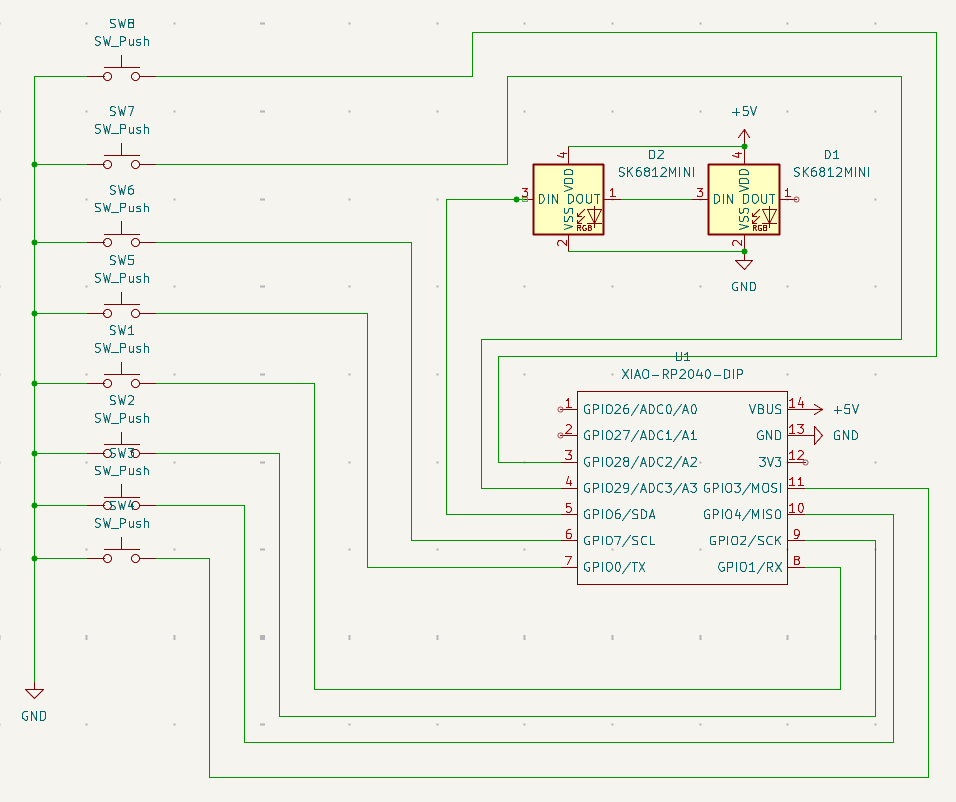
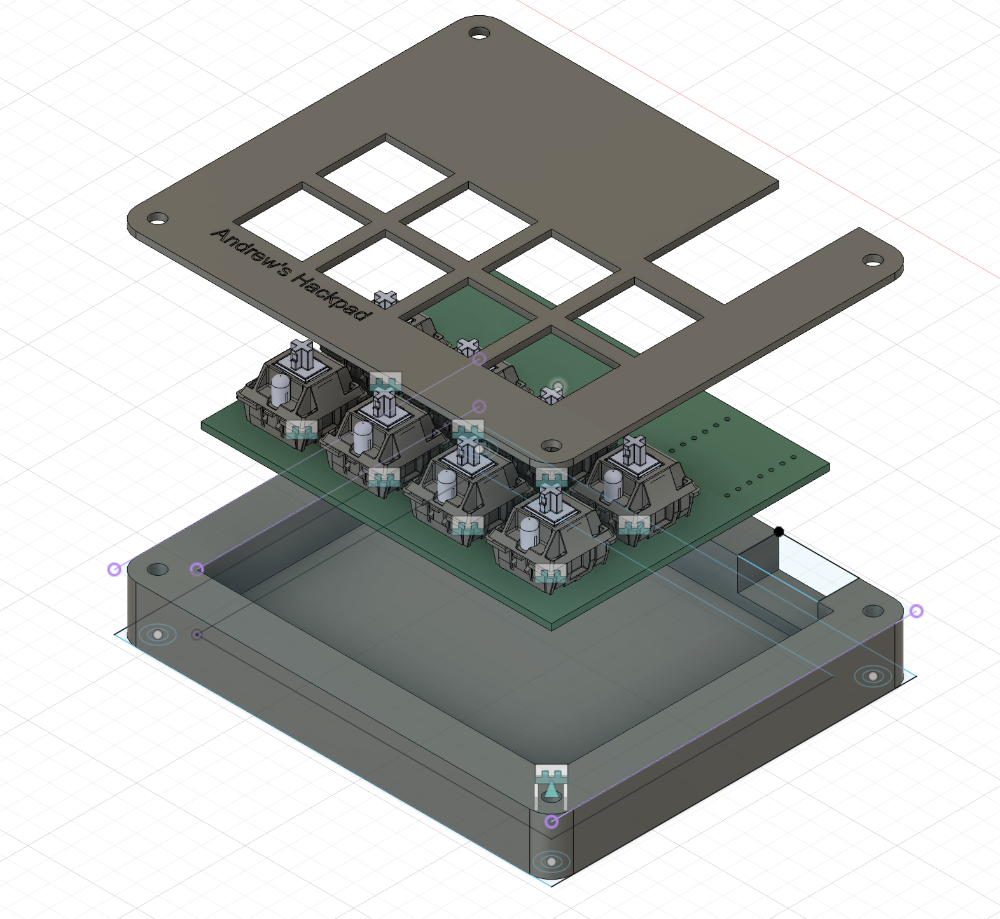

# Cai's Hackpad Submission
# Challenges & Inspiration
I've never used kicad before so I really wanted to learn how to build using it and it was enjoyable to learn.
# PCB

# Schematic

# CAD

# Firmware
I wrote firmware in KMK check main.py
# BOM
8x Cherry MX Switches
2x SK6812 MINI Leds
1x XIAO RP2040
4x Blank DSA Keycaps
4x M3x16 Bolt
4x M3 Heatset
